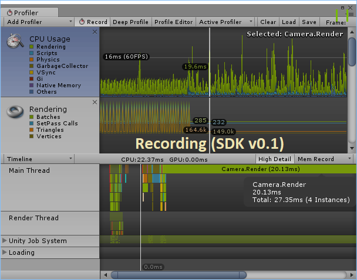

## ShareVR Unity Plugin v0.2 Release
Welcome to ShareVR Unity SDK v0.2 release. There are few exciting improvements we made over the last week and we are really eager to share them with you!

### What's New in SDK 0.2?
- **Voice Command** - Having trouble deciding which key should you map to our control? Well, time to say good bye to keys. In SDK v0.2, we have configured a voice command system powered by IBM Watson Cloud Service. Simply check *Use Voice Command* and speak. Below are a list of available voice commands:
  - *[Start Recording]* - Starts a new recording
  - *[Stop Recording]* - Ends an active recording
- **Significantly reduced render cost during recording** - We spotted a bug in SDK v0.1 that trigger a catastrophic [pipline stall](https://blogs.msdn.microsoft.com/shawnhar/2008/04/14/stalling-the-pipeline/) during recording. Fixing this bug allows us to improve the recording performance by a stunning **~70%** (more details below)!
- **Significantly improved frame rate performance** - No more fluctuating frame rates while recording! Now the frame rate will stay stabilized without big spikes in the rendering time will usually cause jitter in VR.

#### Profiling Data
Below are detailed Unity Profiling results. We tested SDK v0.1 and v0.2 on a normal HD recording setting (720p@30FPS) in SteamVR's interaction system example scene.

##### Improved Rendering Time
With the help of the powerful Unity Profiler, we can easily estimate the additional rendering time that our plugin used during recording. We measured the baseline rendering time with ShareVR in standby mode (*not recording*). In this case, the rendering time are mostly the time it takes to render the game scene itself. We then measured the worst possible rendering length after initialization (*the first few large spikes*). With calculating the difference between these two measurements, we now have a good estimate of how much additional rendering time does our ShareVR plugin added while recording.

We observed our rendering time during recording dropped from *13.67ms* to *4.20ms* which gives us an estimated performance gain of **~69.28%**. Note that this data is taken at the *worst possible spot* which means that the averaged rendering time that ShareVR need during recording will be below *4.20ms*.

##### Stabilized Frame Rate
In addition to rendering time improvement, it's also obvious that the frame rate is now way more stable than SDK v0.1. The main reason behind that is the pipline stall problem. In SDK v0.1 our recording coroutine will cause pipline stall which forces CPU and GPU to sync event with each other. It's costly operation that will lead to significantly increased rendering time. After our fix, the CPU-GPU sync will be managed by SteamVR and Unity which delivers a smooth frame rate.

###### ShareVR Team
4.15.2017
