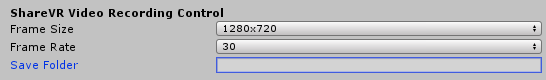
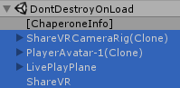

## ShareVR Unity Plugin v0.3 Release
### What's New in SDK v0.3?
#### New Features
- **AWS File Upload and Hosting** - Want to share your awesome in-game recording? Simply check *Upload File Online* option in ShareVR gameobject and your file will be automatically uploaded to our Amazon S3 server! You will see an URL to your file posted in the Unity Console after the upload is done. Note that the uploaded video file is readable to everyone with the link. Your will still have a local copy of the video file even with the file upload option on.

  
  
- **Additional Camera Follow Regime** - We are adding more camera following regimes! In SDK v0.3 we added a new smooth orbit option that you can choose in the ShareVR gameobject in addition to the fixed angle camera.

  

- **User Defined Save Folder** - By default, your captured video file will be saved at ShareVR folder under your current user's Document folder. You will see a full path output in the Console once you finished a recording. From SDK v0.3 and above, we now allow your to customize your own file save directory in the ShareVR gameobject. If you leave it blank, it will automatically go back to the default option.

  
  

#### Bug Fix and Improvements
- Fixed an issue that will cause ShareVR to crash when new game scene is loaded. Now ShareVR game objects will automatically be added to *DontDestroyOnLoad* which protects them from being unloaded when loading new game scenes.

  
- Fixed a bug in live plane render texture that will lead to an annoying arbitrary render texture shown in front of user.
- Fixed a bug related to game layer settings. Unity does not support passing game layer settings in Unity Package so we added a layer checking script that automatically make sure the layer setting is consistent.

###### ShareVR Team
4.23.2017
