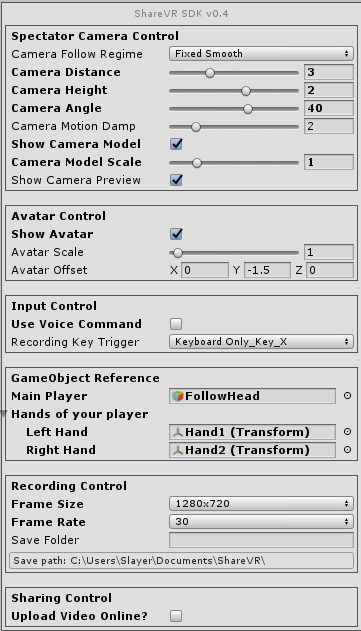
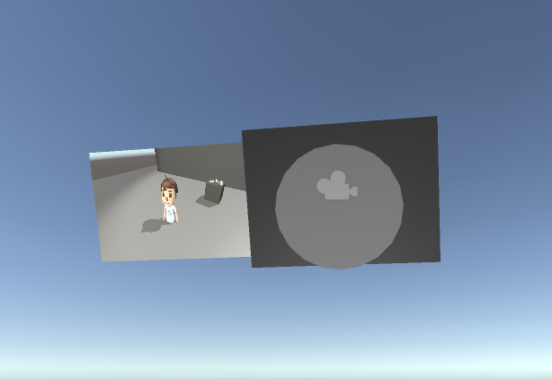

## ShareVR Unity Plugin v0.4 Release
### What's New in SDK v0.4?
#### New Features
- **Completely Re-designed ShareVR Inspector UI** - NEW inspector UI! We knew it's annoying that you have to look into our code to adjust some parameters to customize our feature. And it's just too overwhelming if we simply dump all the parameters together in the ShareVR inspector fields. We addressed this with a brand new, full-customized inspector UI system. You can now access all the parameters and features to fully customize ShareVR into your own VR system. Hope you enjoy the clean and handy control it brings!

  

- **Fully Customizable Camera Position and Auto-follow Regime** - Now, with much more adjustable camera parameters, you can easily customize the spectator camera the way you want.

  

- **Camera Preview Panel** - Spectator camera now will show a live preview panel on the side. This should help you make sure the camera is capturing at the right angle and view.

  

#### Bug Fix and Improvements
- Fixed a bug that will cause live play to freeze.

###### ShareVR Team
4.29.2017
