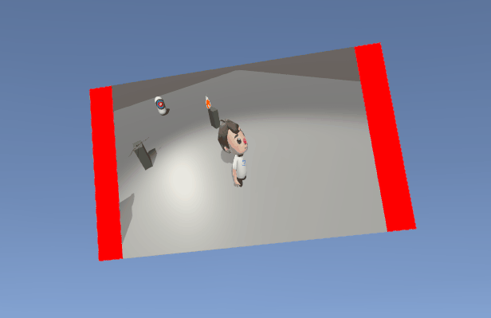
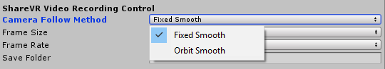

## ShareVR Unity Plugin v0.4c
Welcome to ShareVR Unity SDK v0.4c. Thanks for taking time trying out our plugin. The quick start tutorial will help you quickly setup our plugin. If you have any question, please don't hesitate to contact us at team@sharevr.io

### Getting Started
*ShareVR requires the SteamVR plugin loaded in your project.* To start, please check out our [quick installation video on YouTube](https://www.youtube.com/watch?v=UP00JfT9UtU).

#### Import ShareVR and Load the Example Scene
- Make sure you have [SteamVR](https://www.assetstore.unity3d.com/en/#!/content/32647) plugin in your project
- Import the ShareVR Unity Plugin (currently distributed as a separate UnityPackage)
- Under Assets/ShareVR/Scenes/ open the example scene
- Hit play then you should be able to start testing
  - By default, the recording can be started and stopped by pressing the X key in your keyboard. We provided other mapping options including some that use the Vive Controllers. You can change them in the ShareVR gameobject. We also have an easy to use voice command system setup if you would like to use your own voice to control the recording.
  - **Press X key to start record**. Once you started recording, a ShareVRCameraRig game object will be instantiated with a visible camera model (you can toggle the model display on/off and change the scale of the model in the ShareVR gameobject). You should be able to see the camera started following you and the little green light on the camera indicates it's recording now.
  - Feel free to move around and teleport. The ShareVRCameraRig smoothly follows you as you move.
  - **Press X again to stop recording**. A video file will be created in the "ShareVR" folder under current Windows user's Documents folder. The path to the file will also output to the console window.

    
  - You can record as many times as you want and each session will create a separate video file.

#### Apply ShareVR to Your Own Game
Our goal is make our ShareVR Unity plugin easy-to-use yet still adaptive and customizable so it could fit well in to your own application. Here's an example of how apply ShareVR to the SteamVR InteractionSystem example scene. To give you a quick start, please check out our [quick installation video on YouTube](https://www.youtube.com/watch?v=UP00JfT9UtU).

- Open SteamVR interaction system example scene located at: Assets/SteamVR/InteractionSystem/Samples/Scenes/Interactions_Example
- To use ShareVR, you just need to proceed with the two step below.
  1.  Under Assets/ShareVR/Prefabs/, drag the ShareVR gameobject to anywhere in the scene hierarchy.
  2.  Click the ShareVR gameobject in the scene hierarchy. Reference the target gameobject that you want the spectator camera to track and record by draging the target gameobject into "Player Head Game Object".
  3. (optional) If you are using the avatar ("ShareVR/Show Player Avatar" checked), you need to make sure the main camera ignores the avatar so that the avatar body won't occludes with your main camera. Simply find your main camera (in the InteractionSystem example, it's located at Player/SteamVRObjects/VRCamera) and uncheck "IgnoreInMainCamera" in the Culling Mask list.
- Now you are done with the quick setup. Hit play and you should be able to record just like our example scene.

Note that We have some additional options listed below if you want to customize the plugin to better fit into your game. We kept all the available options in the ShareVR gameobject to make it easier to find. Below are the available options with description:

### ShareVR Control Reference
##### **Spectator Camera Control** 
- *Camera Follow Regime* - use this to control the way capture camera follows the main target
  - *Fixed Smooth* - Camera smoothly follows the target at a fixed angle
    - *Camera Motion Damp* - how fast should the camera move? A high damp value makes the camera moves quick but abrupt. In contrast, a low damp value makes the camera moves slowly but smooth.
  - *Orbit Smooth* - Camera orbits around the target at a fixed speed
    - *Camera Orbit Speed* - angular speed of the orbit camera
  - *Custom Camera*
- *Runtime Adjustable Camera Parameters* - Note that all the camera parameters, including (if applicable) *Camera Orbit Speed* and *Camera Motion Damp*, is adjustable during runtime as shown below

  
  - *Camera Distance* - how far the camera is to the target
  - *Camera Height* - how high the camera is
  - *Camera Angle* - controls where the camera is
- *Show Camera Model* - toggles whether or not a 3D model of the recording camera will be shown. Useful if you want to see where the camera is.
- *Camera Model Scale* - If you are using the camera model, this adjusts the scale of the model so it won't be too small or big.
- *Show Camera Preview* - if enabled, will show a live preview window next to the spectator camera.

- **Avatar Control**
  - *Show Player Avatar* - toggles whether or not a player avatar will be shown in the scene. We currently have a generic free avatar for you to use if you don't have an avatar for the player. Note that you can easily replace it to any 3D model you like. Please contact us if you have any specific need for the avatar.
  - *Avatar Scale* - adjusts the scale of the avatar
  - *Avatar Offset* - adjusts the offset between the avatar to your main player (the Player Head Game Object). Change this if the avatar appears to be off.

- **Input Control**
  - *Use Voice Command* - check this if you want to use our voice command system to control the recording event. When enabled, simply say "Start Recording" and "Stop Recording" to start and stop an capture session.
  - *Recording Key Trigger* - use this to change your desired key mapping that triggers the start / stop recording event. If you don't want to use any key mapping, simply set it to *Dont Use Any Key*

- **GameObject Reference**
  - *Main Player* - reference your main target gameobject here and our spectator camera will track and record it. **_If you leave it empty, we will track the HMD (player's head) by default._**.

- **Recording Control**
  - *Frame Size and Frame Rate* - change it if you want to record with a different resolution or frame rate. The default is 720p at 30 FPS to achieve the optimal balance between video quality and performance. A higher framerate and FPS will come with additional performance cost. Note that, the plugin is configured to always ensure smooth video output, so even if you experienced low FPS in 4K recording settings for example, the output video will still be smooth which is great for recording promotion videos.
  - *Save Folder* - Specify the path where you want the captured video file saved. Leave it blank will trigger the default option which is under ShareVR folder in your system's Documents folder.

- **Sharing Control**
  - *Upload File Online* - check this if you want your video automatically shared to YouTube. Please note：
    - By default, the shared video will be listed as a public YouTube video in the [ShareVR YouTube channel](https://www.youtube.com/channel/UC3dHuvqF8oOiWjejKCnGSLA)
    - It takes up to 3 minutes for YouTube to process the video depend on the length of the video

### Release History
#### Unity SDK v0.4c
##### Targeting Environment
Unity Engine >= 5.6 with HTC Vive

##### What's New in SDK v0.4c?
###### New Features
- **Backend Analytics Framework** - In ShareVR SDK v0.4c, we have a built-in log and video metadata framework setup which will automatically collect usage and configuration data to our AWS backend (DynamoDB).

- **No SteamVR Requirement** - (Experimental) ShareVR plugin's core feature no longer rely on SteamVR and thus does not require SteamVR in the solution. A new native API framework based on OpenVR and Unity's native VR support API is adopted.

- **No SteamVR Requirement** - (Experimental) Since SDK v0.4c, ShareVR plugin's core feature no longer rely on SteamVR and thus does not require SteamVR in the solution. A new native API framework based on OpenVR and Unity's native VR support API is adopted.

- **Fully Sealed DLL Solution** - ShareVR's core code is now sealed into a single DLL package which make it easier to distribute and helps protect code from being modified or copied.

- **Custom Camera Support** - If you want to use your own camera as the dedicated spectator camera, simply choose *Custom Camera* in the Camera Follow Regime and drag your camera gameobject to the target. This allows you to fully customize your own camera trajectory and interaction.

- **Camera Preview Panel Record Status Indicator** - In order for players to see the status of recording, we added a blinking red frame on the camera preview panel. It will blinking red during recording and stay invisible when not recording.

  

##### Bug Fix and Improvements
- Fixed a bug that will cause instability in Unity 5.6

#### Unity SDK v0.4
Release on 4/29/2017
##### New Features
- **Completely Re-designed ShareVR Inspector UI** - NEW inspector UI! We knew it's annoying that you have to look into our code to adjust some parameters to customize our feature. And it's just too overwhelming if we simply dump all the parameters together in the ShareVR inspector fields. We addressed this with a brand new, full-customized inspector UI system. You can now access all the parameters and features to fully customize ShareVR into your own VR system. Hope you enjoy the clean and handy control it brings!

  

- **Fully Customizable Camera Position and Auto-follow Regime** - Now, with much more adjustable camera parameters, you can easily customize the spectator camera the way you want.

  

- **Camera Preview Panel** - Spectator camera now will show a live preview panel on the side. This should help you make sure the camera is capturing at the right angle and view.

  

##### Bug Fix and Improvements
- Fixed a bug that will cause live play to freeze.

#### Unity SDK v0.3
Release on 4/23/2017
##### New Features
- **AWS File Upload and Hosting** - Want to share your awesome in-game recording? Simply check *Upload File Online* option in ShareVR gameobject and your file will be automatically uploaded to our Amazon S3 server! You will see an URL to your file posted in the Unity Console after the upload is done. Note that the uploaded video file is readable to everyone with the link. Your will still have a local copy of the video file even with the file upload option on.

  
  
- **Additional Camera Follow Regime** - We are adding more camera following regimes! In SDK v0.3 we added a new smooth orbit option that you can choose in the ShareVR gameobject in addition to the fixed angle camera.

  

- **User Defined Save Folder** - By default, your captured video file will be saved at ShareVR folder under your current user's Document folder. You will see a full path output in the Console once you finished a recording. From SDK v0.3 and above, we now allow your to customize your own file save directory in the ShareVR gameobject. If you leave it blank, it will automatically go back to the default option.

  
  

##### Bug Fix and Improvements
- Fixed an issue that will cause ShareVR to crash when new game scene is loaded. Now ShareVR game objects will automatically be added to *DontDestroyOnLoad* which protects them from being unloaded when loading new game scenes.

  
- Fixed a bug in live plane render texture that will lead to an annoying arbitrary render texture shown in front of user.
- Fixed a bug related to game layer settings. Unity does not support passing game layer settings in Unity Package so we added a layer checking script that automatically make sure the layer setting is consistent.

#### Unity SDK v0.2
Release on 4/15/2017
##### New Features
- **Voice Command** - Having trouble deciding which key should you map to our control? Well, time to say good bye to keys. In SDK v0.2, we have configured a voice command system powered by IBM Watson Cloud Service. Simply check *Use Voice Command* and speak. Below are a list of available voice commands:
  - *[Start Recording]* - Starts a new recording
  - *[Stop Recording]* - Ends an active recording

##### Bug Fix and Improvements
- **Significantly reduced render cost during recording** - We spotted a bug in SDK v0.1 that trigger a catastrophic [pipline stall](https://blogs.msdn.microsoft.com/shawnhar/2008/04/14/stalling-the-pipeline/) during recording. Fixing this bug allows us to improve the recording performance by a stunning **~70%** (more details below)!
- **Significantly improved frame rate performance** - No more fluctuating frame rates while recording! Now the frame rate will stay stabilized without big spikes in the rendering time will usually cause jitter in VR.

##### Profiling Data
Below are detailed Unity Profiling results. We tested SDK v0.1 and v0.2 on a normal HD recording setting (720p@30FPS) in SteamVR's interaction system example scene.

###### Improved Rendering Time
With the help of the powerful Unity Profiler, we can easily estimate the additional rendering time that our plugin used during recording. We measured the baseline rendering time with ShareVR in standby mode (*not recording*). In this case, the rendering time are mostly the time it takes to render the game scene itself. We then measured the worst possible rendering length after initialization (*the first few large spikes*). With calculating the difference between these two measurements, we now have a good estimate of how much additional rendering time does our ShareVR plugin added while recording.

We observed our rendering time during recording dropped from *13.67ms* to *4.20ms* which gives us an estimated performance gain of **~69.28%**. Note that this data is taken at the *worst possible spot* which means that the averaged rendering time that ShareVR need during recording will be below *4.20ms*.

###### Stabilized Frame Rate
In addition to rendering time improvement, it's also obvious that the frame rate is now way more stable than SDK v0.1. The main reason behind that is the pipline stall problem. In SDK v0.1 our recording coroutine will cause pipline stall which forces CPU and GPU to sync event with each other. It's costly operation that will lead to significantly increased rendering time. After our fix, the CPU-GPU sync will be managed by SteamVR and Unity which delivers a smooth frame rate.

###### ShareVR
6.7.2017
